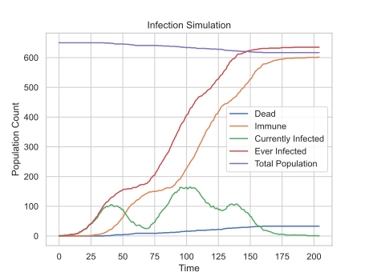

Pandemic Simulator
==================

Simulate your very own pandemic with Python and
the `Arcade <https://arcade.academy>`_ library!

.. image:: simulation.gif

Run the simulation using ``main.py``.

Control simulation parameters with code in that file:

.. code-block:: python

    simulation_parameters = SimulationParameters(
        population_count=650,
        person_size=7,
        frames_to_result=200,
        chance_of_infection=0.6,
        chance_for_immunity=1.0,
        chance_for_death=0.05,
        initial_top_speed=250,
        reporting_interval=10,
        initial_infected_people=1,
        initial_immune_people=0,
        vertical_walls=4,
        door_size=100,
    )